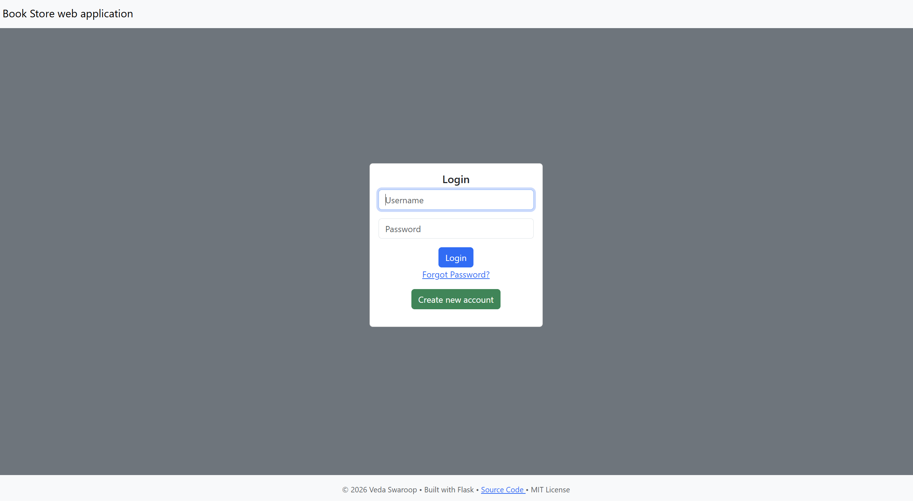
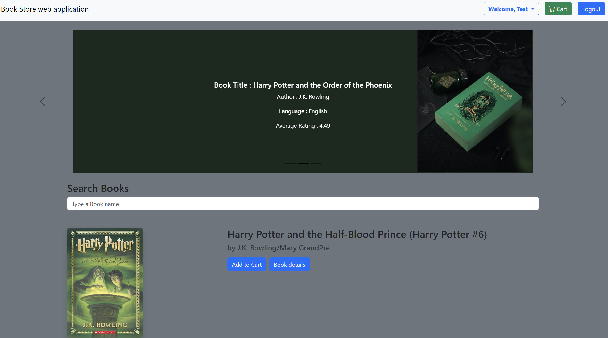
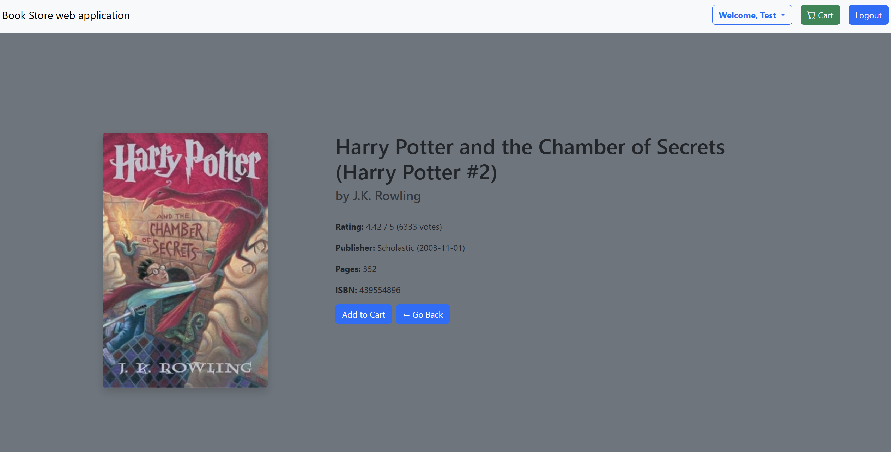
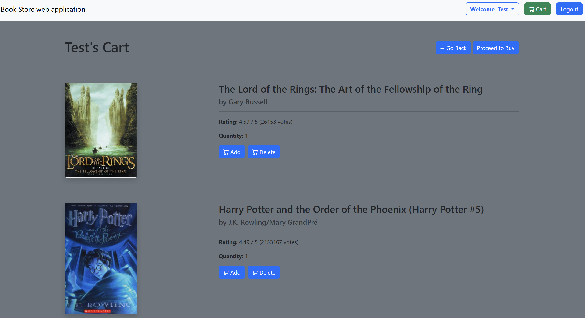
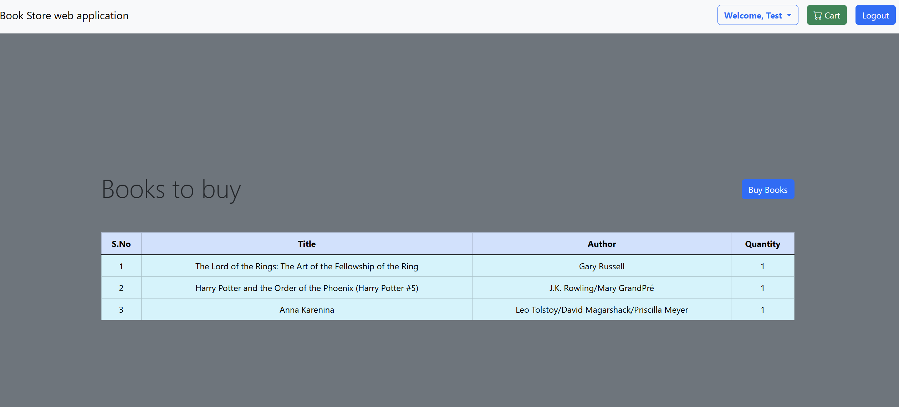
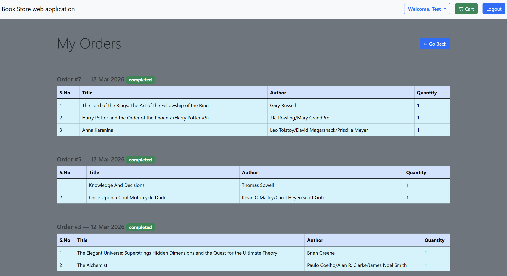

# 📚 BookStore — Full-Stack Flask Web Application

A full-featured online bookstore web application built with **Python/Flask**, featuring user authentication, a shopping cart, order management, and a curated book catalog with cover art. Deployed live on **AWS EC2**.

🌐 **Live Demo:** [BookStore Flask Web Application](https://devport.co.in)

---

## ✨ Features

- 🔐 **User Authentication** — Login from the landing page, register, and logout with Flask-Login and secure session management
- 🔑 **Password Reset** — Users can reset their password by verifying their account details
- 🛒 **Shopping Cart** — Add, update, and remove books from a persistent cart tied to each user
- 🧾 **Order Management** — Place orders, view order confirmation, and browse order history
- 📖 **Book Catalog** — Browse 12,000 books with cover images sourced from the Open Library Covers API
- 🔍 **Search & Filter** — Find books by title, author, or genre
- 🛠️ **Admin Panel** — View and manage registered users; admin can delete user accounts
- 📱 **Responsive UI** — Mobile-friendly layout built with Bootstrap 5
- ☁️ **Cloud Deployed** — Hosted on AWS EC2 with a custom domain

---

## 🛠️ Tech Stack

| Layer | Technology |
|-------|-----------|
| **Backend** | Python, Flask |
| **Database** | PostgreSQL + SQLAlchemy ORM (2.0 style) |
| **Auth** | Flask-Login |
| **Forms** | Flask-WTF |
| **Templating** | Jinja2 |
| **Frontend** | Bootstrap 5, JavaScript |
| **Deployment** | AWS EC2 (Ubuntu), Gunicorn / Nginx |
| **Book Covers** | Open Library Covers API |

---

## 🗄️ Database Models

```
User ──< Order ──< OrderItem >── Book
User ──< Cart  ──< CartItem  >── Book
```

- **User** — Stores account credentials and profile info
- **Book** — Catalog of books with metadata and cover image references
- **Cart** — One active cart per user
- **CartItem** — Line items linking books to a cart with quantity
- **Order** — A confirmed purchase placed by a user
- **OrderItem** — Line items capturing book, quantity, and price at time of purchase

---

## 🚀 Getting Started (Local Development)

### Prerequisites

- Python 3.10+
- PostgreSQL

### Installation

```bash
# Clone the repository
git clone https://github.com/Veda-Swaroop/Flask_web_app.git
cd Flask_web_app

# Create and activate a virtual environment
python -m venv venv
source venv/bin/activate        # On Windows: venv\Scripts\activate

# Install dependencies
pip install -r requirements.txt

# Create a PostgreSQL database
createdb bookstore_db

# Configure environment variables
cp .env.example .env
# Edit .env and fill in DATABASE_URL and SECRET_KEY

# Set up the database tables
flask db upgrade

# Run the development server
python run.py
```

Visit `http://localhost:5000` in your browser.

---

## 📁 Project Structure

```
FLASK_WEB_APP/
├── app/
│   ├── admin/                       # Admin blueprint
│   │   ├── __init__.py
│   │   └── routes.py                # View users, delete user accounts
│   ├── auth/                        # Auth blueprint
│   │   ├── __init__.py
│   │   └── routes.py                # Login, register, password reset
│   ├── main/                        # Main blueprint
│   │   ├── __init__.py
│   │   └── routes.py                # Catalog, book detail, cart, orders
│   ├── static/
│   │   ├── covers/                  # Book cover images — not included in repo (see note below)        
|   |   ├── images/                  # App images - for carousal  
│   │   └── favicon.ico
│   ├── templates/
│   │   ├── layout.html              # Base template
│   │   ├── index.html               # Landing page with login form
│   │   ├── home.html                # Main catalog / browse page (post-login)
│   │   ├── book_detail.html         # Individual book page
│   │   ├── cart.html                # Shopping cart
│   │   ├── order.html               # Order summary
│   │   ├── order_confirmation.html  # Post-purchase confirmation
│   │   ├── my_orders.html           # User order history
│   │   ├── register.html            # Registration form
│   │   ├── verify.html              # Identity verification step for password reset
│   │   ├── reset.html               # Password reset page
│   │   ├── logout.html              # Logout confirmation
│   │   └── admin.html               # Admin panel — user list and delete
│   ├── __init__.py                  # App factory
│   ├── extensions.py                # Flask extensions (db, login_manager, migrate)
│   ├── forms.py                     # Flask-WTF form definitions
│   └── models.py                    # SQLAlchemy ORM models
├── migrations/                      # Flask-Migrate migration files
├── .env                             # Environment variables (not committed)
├── .gitignore
├── LICENSE
├── run.py                           # Development entry point
└── wsgi.py                          # Production WSGI entry point (Gunicorn)
```

---

## ☁️ Deployment

The app is deployed on **AWS EC2** (Ubuntu) using:

- **Gunicorn** as the WSGI server (via `wsgi.py`)
- **Nginx** as the reverse proxy
- **PostgreSQL** running on the EC2 instance
- A custom domain with DNS pointing to the EC2 public IP

---

## 🔧 Notable Engineering Details

- Organized routes using **Flask Blueprints** (`admin`, `auth`, `main`) for clean separation of concerns and maintainability
- Managed Flask extensions in a dedicated `extensions.py` to avoid circular imports — a common pitfall in larger Flask apps
- Used **SQLAlchemy 2.0** `Mapped`/`mapped_column` syntax for type-safe, modern ORM models
- Built a **password reset flow** in the auth blueprint — users verify their identity against the database and reset their password in-app
- Book cover images (~8,000–9,000 images for a catalog of 12,000 books) were downloaded from the **Open Library Covers API** and stored locally under `static/covers/`. This folder is **not included in the repository** due to GitHub's storage limits — see the note below on how to restore them
- Modeled the **cart → order flow** so that placing an order snapshots the price at time of purchase in `OrderItem`, protecting against future price changes affecting order history
- Implemented **toast notifications** via JavaScript for cart actions without full page reloads

---

## 📁 Book Covers Note

The `app/static/covers/` folder is **not included in this repository**. It contains ~8,000–9,000 cover images for the 12,000-book catalog, which exceeds GitHub's recommended repository size limits.

The covers were downloaded from the [Open Library Covers API](https://openlibrary.org/dev/docs/api#anchor_images) using a separate Python script. To run the app locally with cover images:

1. Create the folder: `app/static/covers/`
2. For each book in your database, fetch its cover from Open Library using its ISBN:
   ```
   https://covers.openlibrary.org/b/isbn/{ISBN}-L.jpg
   ```
3. Save each image as `{bookID}.jpg` inside the `covers/` folder

Books without a cover image will fall back to a placeholder automatically.

---

## 📸 Screenshots


**Login / Landing**
<p align="center">
    
</p>

**Home / Catalog**
<p align="center">

</p>

**Book Detail**
<p align="center">

</p>

**Shopping Cart**
<p align="center">

</p>

**Order Confirmation**
<p align="center">

</p>

**Order History**
<p align="center">

</p>


---

## 📄 License

This project is open source and available under the [MIT License](LICENSE).